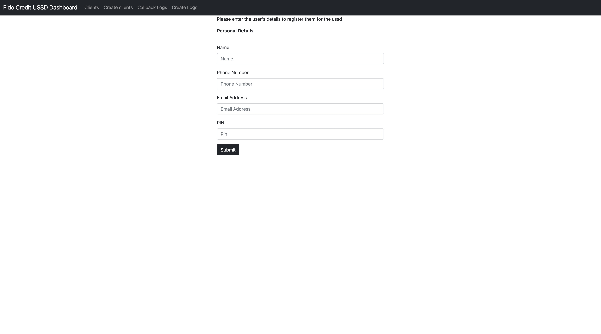
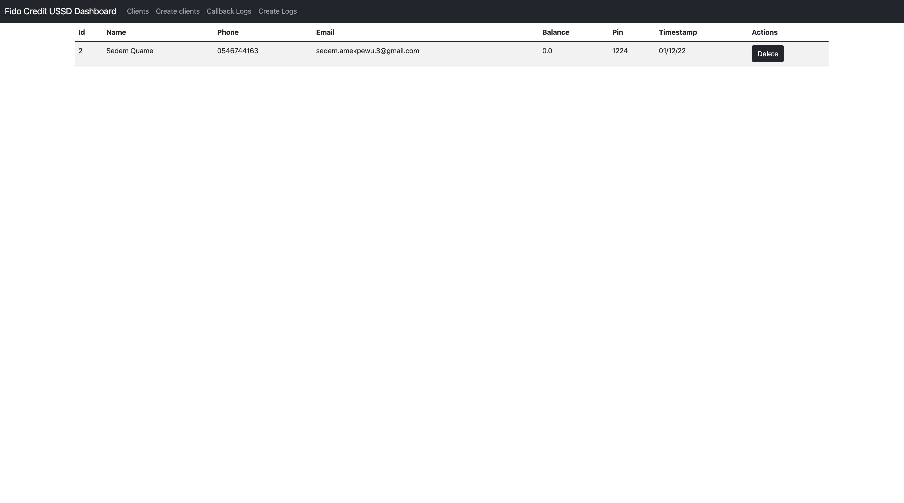
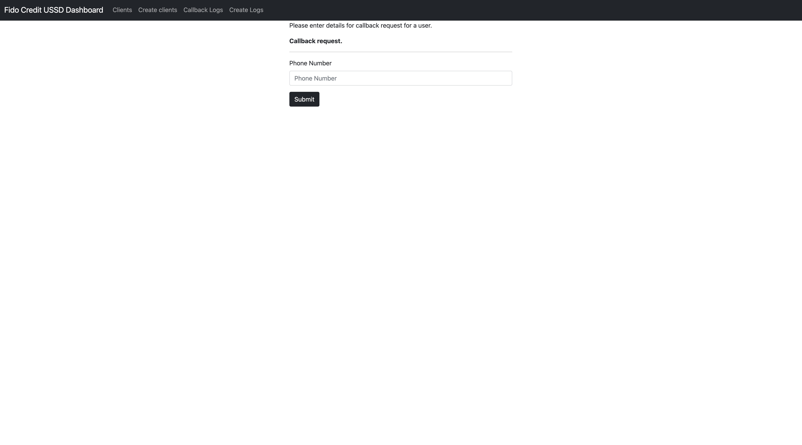
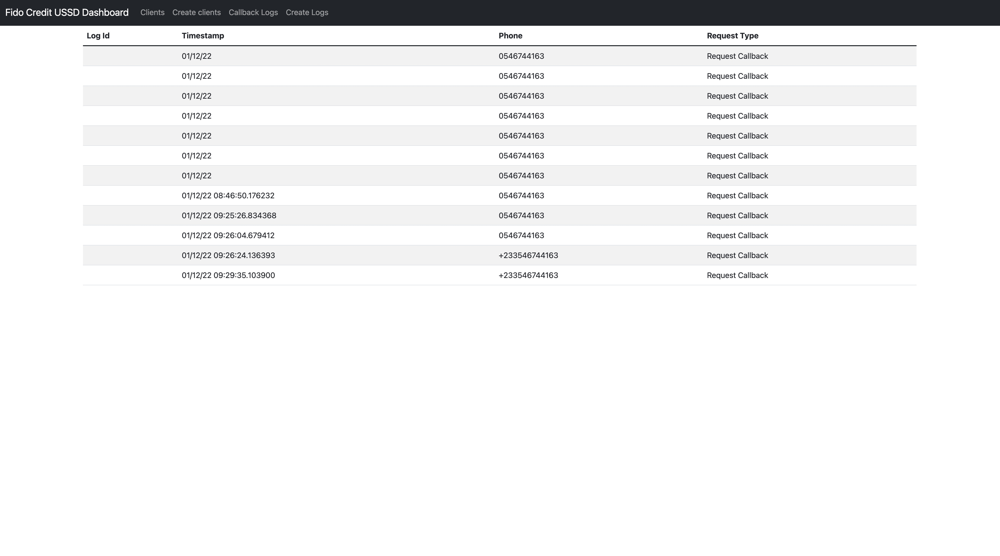
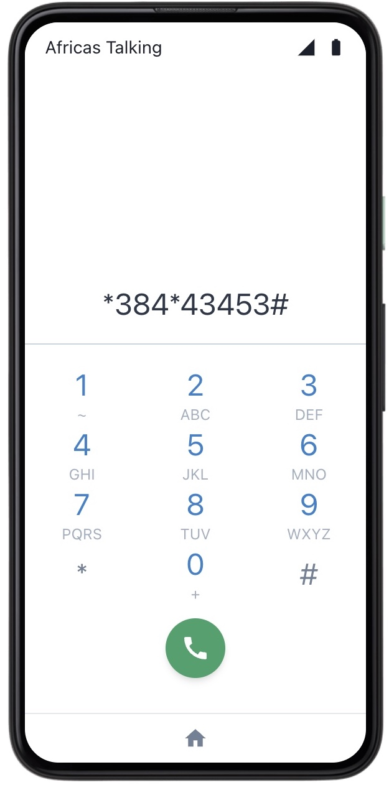
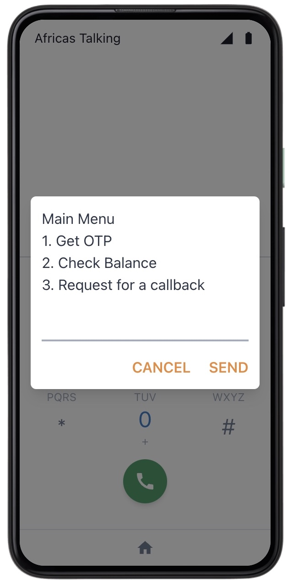
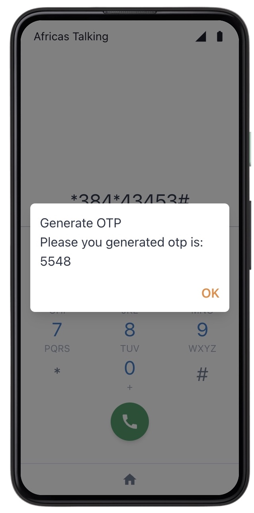
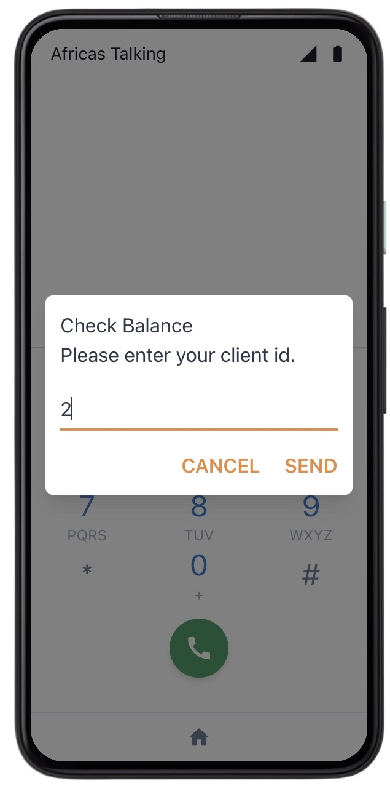
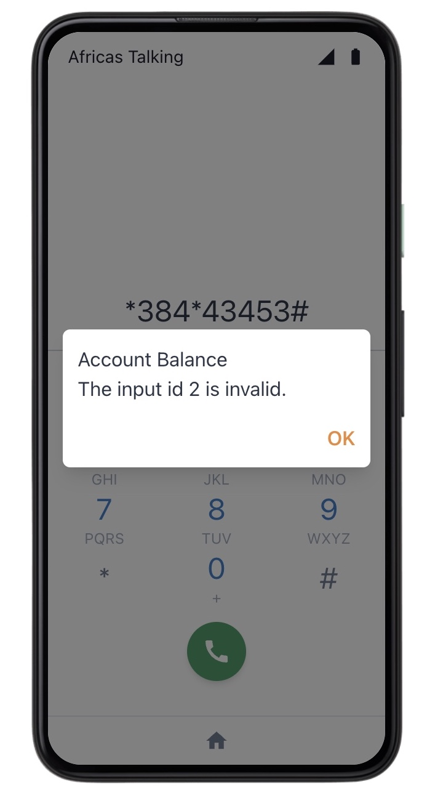
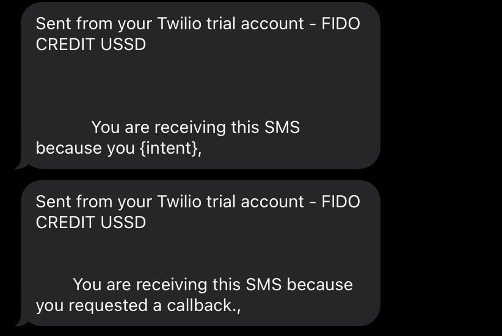

# Setting Up a USSD Service for FIDO CREDIT.

#### A step-by-step guide (Dial *384*34857# on the sandbox)

- Setting up the logic for USSD is easy with the [Africa's Talking API](docs.africastalking.com/ussd).
  This is a guide to how to use the code provided on this [repository](https://github.com/SedemQuame/fido-ussd-app) to create a USSD that allows registered users to get an OTP, check balance and request a callback.

|         USSD APP Features |
| ------------------------: |
|                1. GET OTP |
|          2. Check Balance |
| 3. Request for a callback |

## Prerequisites

- To run this program, run the flask API, using `flask run`.
  Sign up to twilio, and add the following environment variables

```SHELL

// Specify your Twilio credentials, to send SMS.
$ export TWILIO_ACCOUNT_SID=
$ export TWILIO_AUTH_TOKEN=

```

## USSD APP & DASHBOARD

To get more information on the how the API works,
please look at this postman [documentation](https://documenter.getpostman.com/view/9702163/2s8Yt1s9YZ).

The API also has a dashboard, that allows admin to.

1. Register new users. => [register](http://127.0.0.1:5000/new)
   

2. View registered users. => [clients](http://127.0.0.1:5000/all)
   

3. Manually create callback requests. => [Create callback requests](http://127.0.0.1:5000/new-log)
   

4. View callback requests. => [View clients](http://127.0.0.1:5000/logs)
   

## SIMULATION

A look at the simulated USSD application.

1. USSD Code

   

2. USSD Menu

   

3. Generate OTP

   

4. Get user balance

   

5. User Balance

   

6. Invalid user id

   

7. Callback Request,
   Below is a look at a sample SMS, sent from the service.

   

- That is basically the application!
